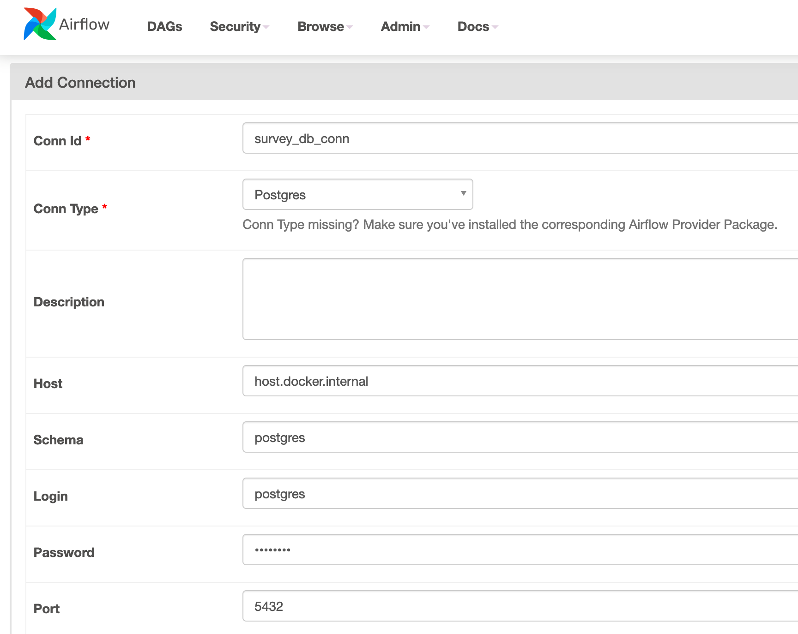
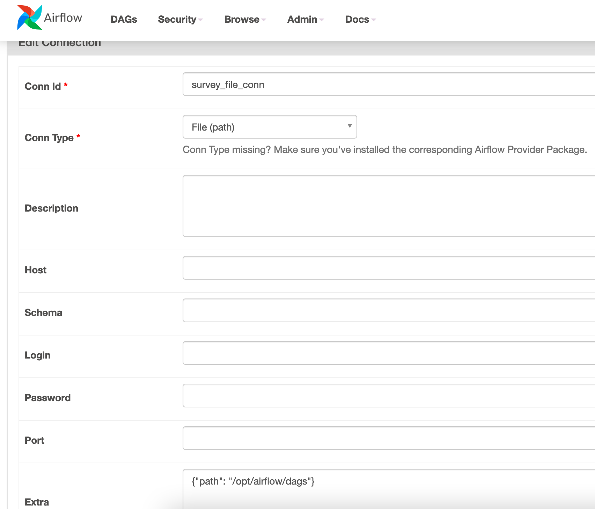

# Simple Friend Recommender

Project to demonstrate stuff a data engineer should know

## Getting Started

### Starting the Project

```sh
./start.sh
```

Then we can go to the survey with the following links:
* http://localhost:8000/questions/0
* http://localhost:8000/admin

For Airflow UI, we go to:
* http://localhost:8080

### Stopping the Project

```sh
./stop.sh
```

### Testing an Airflow Task

```sh
airflow tasks test survey_data_processing transform_data_for_recommender 2021-04-04
```

### Setting Up the Airflow's Connections

In this talk, we'll set up 2 connections as follows:

1. Postgres connection:

    

1. File system connection:

    

### Starting a Simple Dashboard

It shows an answer count.

```sh
python3 -m http.server 8088
```

Then we go to http://localhost:8088/answer_count.html.

### Starting a Jupyter Server (Local)

```sh
cd airflow/dags/notebooks
jupyter notebook
```

Go to http://localhost:8888 if your Web browser is not automatically fired up.

Note that We'll need to set up an virtual environment first under the folder `airflow/dags/notebooks` in case it hasn't been done.

```sh
python3 -m venv ENV
source ENV/bin/activate
pip install -r requirements.txt
```

To deactivate, run:

```sh
deactivate
```